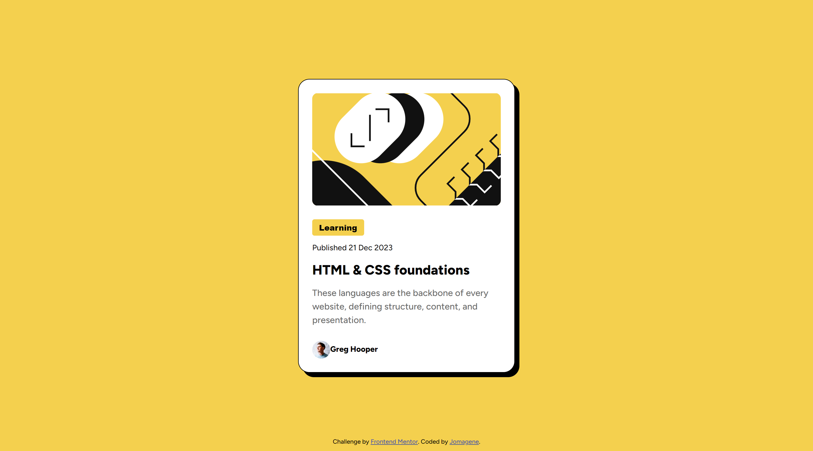

# Frontend Mentor - Blog preview card solution

This is a solution to the [Blog preview card challenge on Frontend Mentor](https://www.frontendmentor.io/challenges/blog-preview-card-ckPaj01IcS). Frontend Mentor challenges help you improve your coding skills by building realistic projects.

## Table of contents

- [Overview](#overview)
  - [The challenge](#the-challenge)
  - [Screenshot](#screenshot)
  - [Links](#links)
- [My process](#my-process)
  - [Built with](#built-with)
  - [What I learned](#what-i-learned)
  - [Continued development](#continued-development)
  - [Useful resources](#useful-resources)
- [Author](#author)
- [Acknowledgments](#acknowledgments)

## Overview

### The challenge

Users should be able to:

- See hover and focus states for all interactive elements on the page

### Screenshot



### Links

- Solution URL: [Add solution URL here](https://your-solution-url.com)
- Live Site URL: [Add live site URL here](https://your-live-site-url.com)

## My process

### Built with

- Semantic HTML5 markup
- **CSS custom properties (variables)**
- **CSS media queries**
- Flexbox

### What I learned

This project deepened my understanding of CSS custom properties (variables) and media queries, which are crucial for creating maintainable and responsive designs. Here are some examples:

```css
/* Variables */
:root {
  --yellow: hsl(47, 88%, 63%);
  --white: hsl(0, 0%, 100%);
  --gray-500: hsl(0, 0%, 42%);
  --gray-950: hsl(0, 0%, 7%);
  --bold: 800;
  --normal: 500;
}

/* Media Queries */
@media (min-width: 576px) {
  .button,
  .publish-date,
  .name {
    font-size: 14px;
  }
  .title {
    font-size: 24px;
  }
  .description {
    font-size: 16px;
  }
}
```

### Continued development

In future projects, I plan to continue leveraging CSS variables for theme management and consistency across designs. Additionally, I will focus on refining my use of media queries to ensure optimal responsiveness on a variety of devices.

### Useful resources

- [CSS Tricks](https://css-tricks.com) - This site has been invaluable for understanding and implementing CSS custom properties and media queries.
- [MDN Web Docs](https://developer.mozilla.org) - A comprehensive resource for all things web development, including detailed documentation on CSS variables and media queries.

## Author

I'm Joel Magene. My profile here:

- Frontend Mentor - [@Jomagene](https://www.frontendmentor.io/profile/Jomagene)
- Twitter - [@Jomagene](https://www.twitter.com/Jomagene)

## Acknowledgments

Thanks to Frontend Mentor for providing such an excellent platform for honing web development skills. Also, a shoutout to the community for their constant support and feedback.
